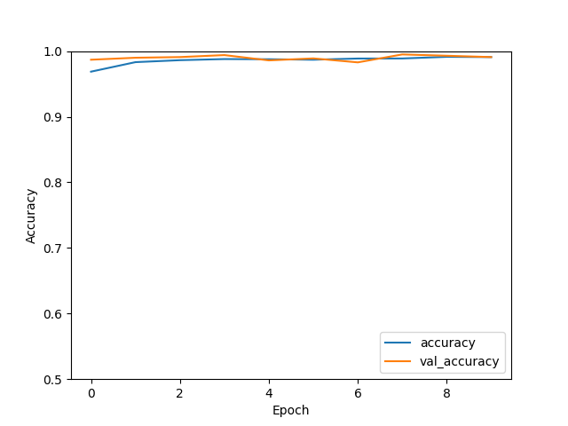
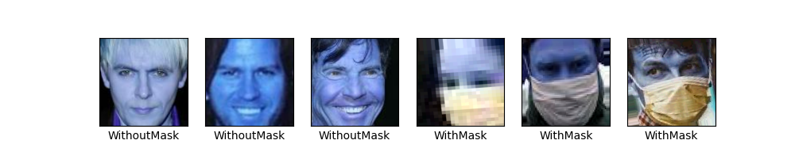
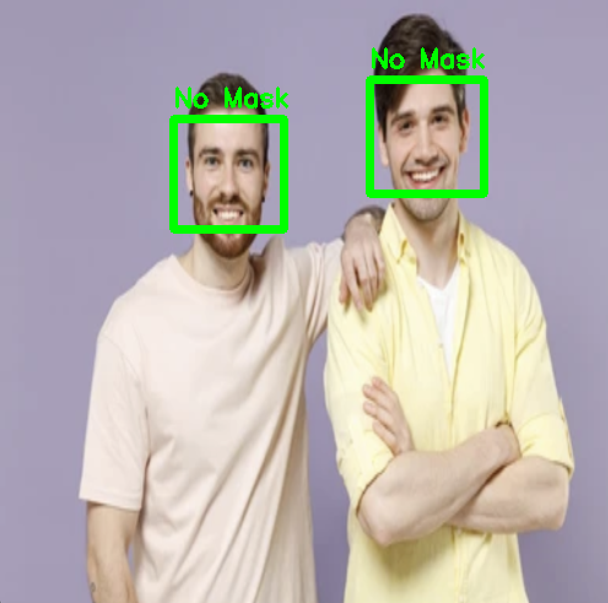
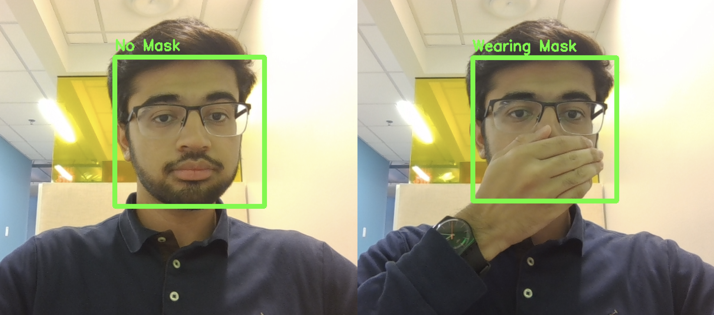

# Face Mask Object Detection
This is a live, real-time face mask detection system. It uses a two-stage pipeline to identify whether individuals in images are wearing face masks. The model leverages transfer learning with MobileNet to classify facial images into two categories: With Mask and Without Mask. It was trained on a balanced dataset of 10,992 images using TensorFlow and Keras.

Face detection is handled separately using a Haar Cascade Classifier, allowing the system to locate faces before passing them to the classifier. I’ve included the trained CNN model (`classifier_model.h5`) and supporting files for running detection and classification tasks (`classifierModel.py`, `detectorModel.py`, and `haarcascade_frontalface_default.xml`).

## Performance Metrics
Model accuracy: Above 90%



Testing the Model with 6 New Images



Evaluating the Completed Object Detection Pipeline



Real Time Face Mask Detection



## Dataset & Dataset Structure
[face-mask-12k-images-dataset](https://www.kaggle.com/datasets/ashishjangra27/face-mask-12k-images-dataset/code?datasetId=675484&sortBy=voteCount)

```
Dataset/
├── Train/
│   ├── WithMask/
│   └── WithoutMask/
└── Test/
    ├── WithMask/
    └── WithoutMask/
```

## Requirements
```
Python 3.10.16 
keras 2.10.0
matplotlib 3.10.3
numpy 1.23.5
opencv-python 4.11.0.86
pillow 11.2.1
scikit-learn 1.6.1
tensorflow 2.10.0
```
